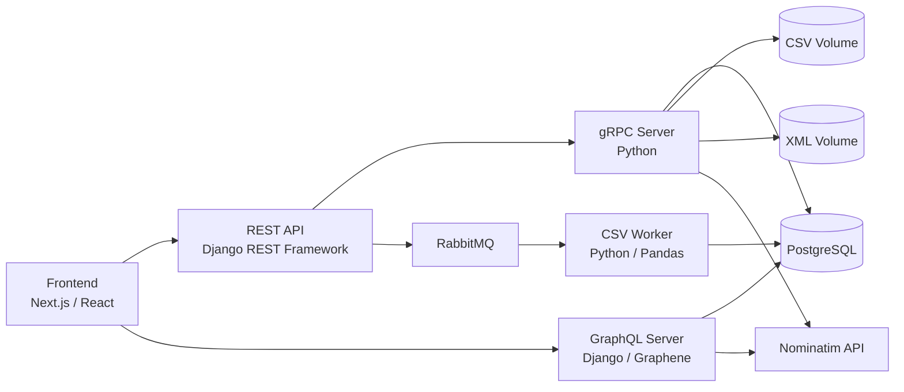

# IS-Final — Integração de Sistemas

Projeto desenvolvido no âmbito da unidade curricular de **Integração de Sistemas**, da Licenciatura em Engenharia Informática do Instituto Politécnico de Viana do Castelo.

A aplicação integra diferentes mecanismos de comunicação e processamento de dados — **REST, gRPC, GraphQL e RabbitMQ** — numa arquitetura baseada em contentores Docker. O sistema permite carregar ficheiros CSV/XSD, processar dados de vendas, converter CSV para XML, enriquecer registos com coordenadas geográficas, consultar e ordenar XML e visualizar localizações num mapa interativo.

**Autor:** Luís Filipe Esteves Dias — n.º 29404  
**Ano letivo:** 2024/2025

---

## Funcionalidades

- Upload de ficheiros CSV e XSD através do frontend.
- Processamento assíncrono de CSV com RabbitMQ e um worker dedicado.
- Armazenamento de dados em PostgreSQL.
- Conversão de ficheiros CSV para XML através de gRPC.
- Enriquecimento de registos sem coordenadas com a API Nominatim.
- Pesquisa de texto em ficheiros XML.
- Ordenação de XML por campo, em ordem ascendente ou descendente.
- Listagem dos ficheiros CSV e XML disponíveis nos volumes Docker.
- Consulta de dados através de GraphQL.
- Pesquisa de clientes por cidade num mapa Leaflet.
- Atualização da localização de um cliente através do mapa e reverse geocoding com Nominatim.

---

## Arquitetura

O projeto está dividido em serviços independentes, executados através de Docker Compose.



### Serviços

| Serviço | Função principal | Porta no host |
|---|---|---:|
| `frontend` | Interface web, mapa e operações do utilizador | `3001` |
| `rest-api-server` | Endpoints REST e ligação aos restantes serviços | `8000` |
| `graphql-server` | Queries e mutations GraphQL | `8001` |
| `grpc-server` | Processamento de ficheiros e operações CSV/XML | `50051` |
| `rabbitmq` | Broker de mensagens | `5672` |
| `rabbitmq-management` | Interface de administração RabbitMQ | `15672` |
| `worker` | Consumo e processamento dos chunks CSV | — |
| `db` | PostgreSQL | `5435` |

### Contentores Docker

Todos os componentes da aplicação são executados de forma isolada no Docker e comunicam através da rede criada pelo Compose.


---

## Dataset

O projeto utiliza o dataset **Retail Supply Chain Sales**, contendo informação relativa a encomendas, clientes, produtos, vendas e localização geográfica.

Fonte: [Retail Supply Chain Sales Dataset — Kaggle](https://www.kaggle.com/datasets/shandeep777/retail-supply-chain-sales-dataset)


---

## Base de dados

Os dados processados são organizados em três tabelas principais:

- `cities` — informação geográfica associada aos clientes;
- `orders` — encomendas, datas e respetivo cliente;
- `products` — produtos, categorias, vendas e relação com a encomenda.


---

## Fluxo de upload

### Upload de CSV

O frontend envia o ficheiro para o REST API Server. O conteúdo é dividido em chunks e publicado na fila `REQUESTS` do RabbitMQ. O worker consome as mensagens, reconstrói o CSV e processa os registos para PostgreSQL. Em paralelo, o ficheiro é enviado ao servidor gRPC para armazenamento no volume CSV.


A atividade da fila pode ser acompanhada através do RabbitMQ Management.


Os logs dos vários serviços permitem acompanhar o processamento dos chunks, a receção do ficheiro pelo gRPC e a resposta do endpoint REST.


### Upload de XSD

Os ficheiros XSD utilizados nas operações XML podem igualmente ser carregados através da interface e armazenados no volume dedicado aos ficheiros XML.


---

## Conversão CSV para XML

A conversão é iniciada no frontend e encaminhada pelo REST API Server para o serviço gRPC. O ficheiro XML gerado fica disponível no volume `xml`.


### Enriquecimento geográfico

Quando um CSV não possui latitude e longitude, o servidor utiliza o **Nominatim**, através da biblioteca `geopy`, para obter as coordenadas com base nos dados de localização disponíveis. É criado um CSV enriquecido antes da geração do XML.


---

## Consulta geográfica

O frontend apresenta os dados geográficos num mapa baseado em **Leaflet**. A pesquisa por nome de cidade filtra os resultados e centra a visualização nos registos encontrados.


Os marcadores podem também ser reposicionados. Depois da alteração das coordenadas, o GraphQL Server utiliza reverse geocoding do Nominatim para atualizar os restantes campos da localização.

---

## Operações XML

A aplicação disponibiliza operações sobre os ficheiros XML armazenados nos volumes:

- pesquisa de texto;
- ordenação por campo;
- escolha de ordem ascendente ou descendente;
- listagem dos ficheiros disponíveis;
- geração de novos XML a partir de CSV.

As operações XML são implementadas em Python com `lxml`, sendo o REST API Server a interface utilizada pelo frontend e o gRPC responsável por parte do processamento de ficheiros.

---

## GraphQL

O servidor GraphQL permite consultar os dados guardados em PostgreSQL e efetuar operações relacionadas com cidades, encomendas e produtos.

Entre as operações implementadas encontram-se:

- consulta de cidades;
- filtragem de cidades por nome;
- consulta de encomendas e produtos;
- atualização de coordenadas de uma localização;
- integração com Nominatim para obtenção dos dados geográficos associados às novas coordenadas.

O endpoint GraphQL está disponível em:

```text
http://localhost:8001/graphql/
```

---

## Estrutura do projeto

```text
ISFinal-main/
├── graphql-server/             # Django + Graphene
├── grpc-server/                # servidor gRPC e processamento CSV/XML
├── is-frontend-template-main/  # Next.js / React / TypeScript
├── rest_api_server/            # Django REST Framework
├── worker-rabbit-csv/          # consumidor RabbitMQ e processamento CSV
├── docker-compose.yml
└── .env.development
```

---

## Tecnologias utilizadas

**Backend e integração**

- Python
- Django
- Django REST Framework
- Graphene / GraphQL
- gRPC
- RabbitMQ
- Pandas
- lxml / XPath
- geopy / Nominatim

**Frontend**

- Next.js
- React
- TypeScript
- Material UI
- Leaflet / React-Leaflet
- Supercluster

**Infraestrutura e dados**

- Docker
- Docker Compose
- PostgreSQL
- CSV
- XML / XSD

---

## Execução

### Pré-requisitos

É necessário ter instalado:

- Docker Desktop;
- Docker Compose;
- Git, caso o projeto seja obtido através de um repositório remoto.

### Arranque dos serviços

Na raiz do projeto:

```bash
docker compose up --build
```

Para executar em background:

```bash
docker compose up --build -d
```

Para terminar a execução:

```bash
docker compose down
```

Para remover também os volumes persistentes:

```bash
docker compose down -v
```

### Endereços úteis

| Componente | Endereço |
|---|---|
| Frontend | `http://localhost:3001` |
| REST API | `http://localhost:8000` |
| GraphQL | `http://localhost:8001/graphql/` |
| RabbitMQ Management | `http://localhost:15672` |
| PostgreSQL | `localhost:5435` |
| gRPC | `localhost:50051` |

Credenciais RabbitMQ definidas no `docker-compose.yml`:

```text
user: user
password: password
```

> A configuração incluída no projeto foi preparada para desenvolvimento local e contexto académico. As variáveis de ambiente e credenciais devem ser adaptadas antes de qualquer utilização fora desse ambiente.

---

## Volumes

O Docker Compose utiliza volumes para manter os dados e ficheiros gerados entre contentores:

```text
csv             ficheiros CSV carregados e enriquecidos
xml             ficheiros XML/XSD gerados ou carregados
pgdata          dados PostgreSQL
rabbitmq_data   dados do RabbitMQ
```

---

## Fluxos principais

### Importação de dados

```text
Frontend
   ↓
REST API
   ├──→ RabbitMQ → Worker → PostgreSQL
   └──→ gRPC → volume CSV
```

### Conversão de dados

```text
Frontend
   ↓
REST API
   ↓
gRPC Server
   ├──→ Nominatim, quando necessário
   ├──→ CSV enriquecido
   └──→ XML
```

### Consulta no mapa

```text
Frontend
   ↓
GraphQL
   ↓
PostgreSQL
   ↓
Leaflet
```

---

## Contexto académico

Este projeto foi realizado como trabalho final da unidade curricular de **Integração de Sistemas**, com o objetivo de aplicar diferentes tecnologias de integração numa única solução e compreender a comunicação entre serviços síncronos, assíncronos e APIs de consulta.

Orientação: **Professor Doutor Jorge Ribeiro** e **Professor Leonardo Magalhães**.
