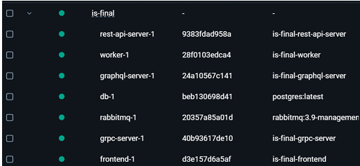
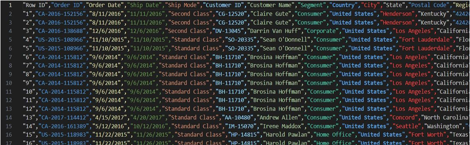
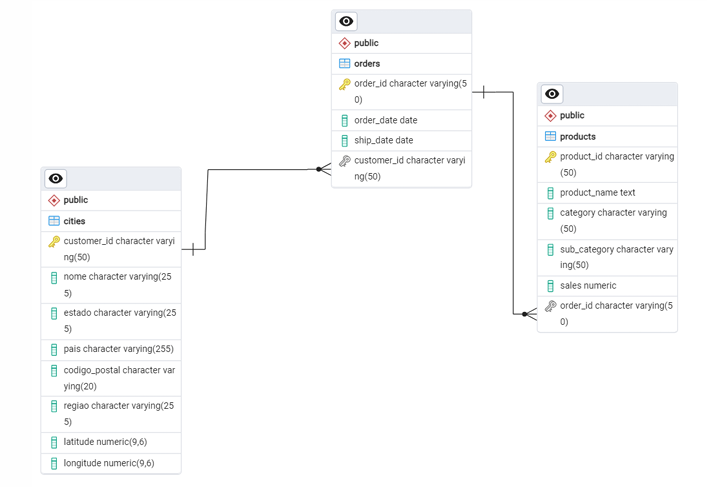
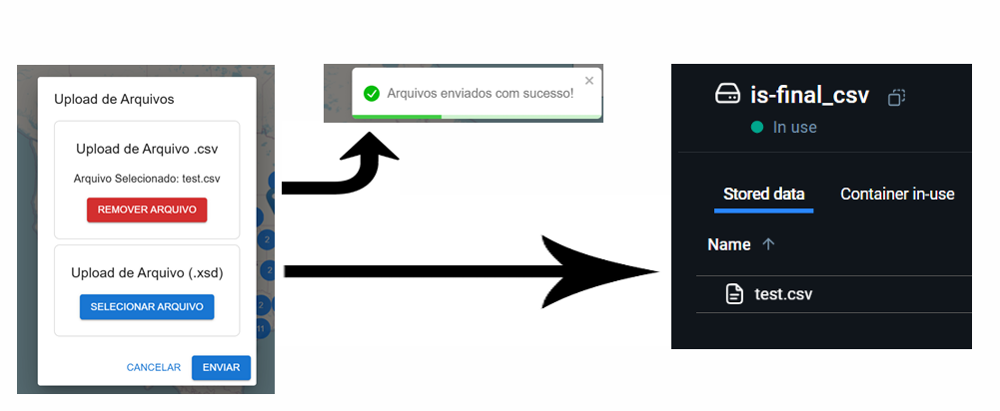
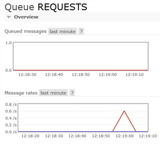
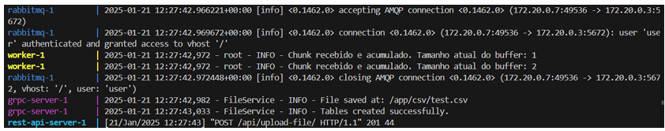
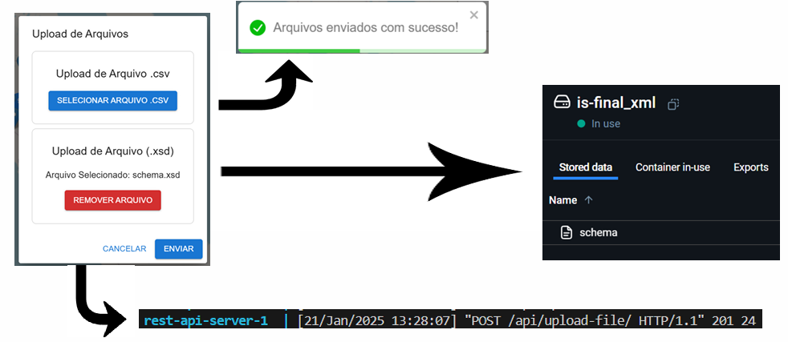
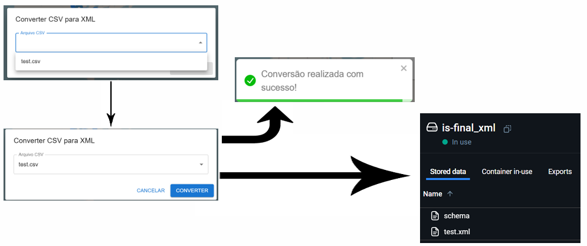
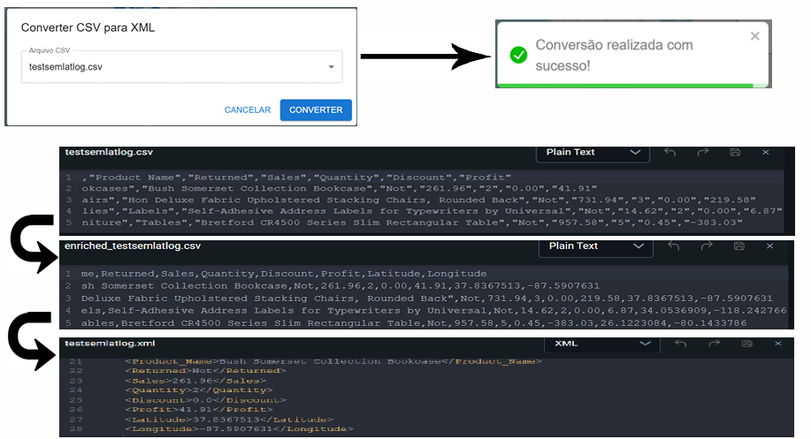
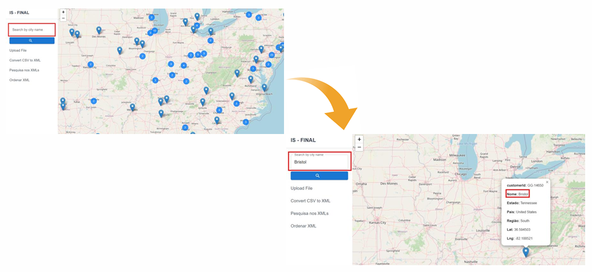

# IS Final - Integração de Sistemas

Trabalho final desenvolvido na unidade curricular de **Integração de Sistemas**, da Licenciatura em Engenharia Informática do Instituto Politécnico de Viana do Castelo.

O projeto reúne vários serviços com funções diferentes. O frontend permite carregar ficheiros, consultar dados e visualizar localizações num mapa. No backend são usados REST, gRPC, GraphQL e RabbitMQ para comunicação, processamento e acesso aos dados.

**Aluno:** Luís Filipe Esteves Dias, n.º 29404  
**Ano letivo:** 2024/2025

## Tecnologias

- Python
- Django
- Django REST Framework
- GraphQL / Graphene
- gRPC
- RabbitMQ
- PostgreSQL
- Pandas
- lxml / XPath
- geopy / Nominatim
- Next.js
- React
- TypeScript
- Material UI
- Leaflet
- Docker
- Docker Compose

## Estrutura do projeto

```text
ISFinal-main/
├── graphql-server/
├── grpc-server/
├── is-frontend-template-main/
├── rest_api_server/
├── worker-rabbit-csv/
├── docker-compose.yml
└── .env.development
```

Cada pasta corresponde a uma parte da aplicação:

| Componente | Função |
|---|---|
| `frontend` | Interface web e mapa |
| `rest-api-server` | Endpoints REST e ligação ao gRPC e RabbitMQ |
| `graphql-server` | Consultas e alterações sobre os dados em PostgreSQL |
| `grpc-server` | Operações sobre CSV e XML |
| `worker` | Consumo e processamento dos dados enviados pelo RabbitMQ |
| `rabbitmq` | Fila de mensagens usada no processamento do CSV |
| `db` | Base de dados PostgreSQL |

## Docker

A aplicação é executada com Docker Compose. Os serviços correm em contentores separados e comunicam através da rede criada pelo Docker.



Portas usadas no projeto:

| Serviço | Porta |
|---|---:|
| Frontend | `3001` |
| REST API | `8000` |
| GraphQL | `8001` |
| gRPC | `50051` |
| RabbitMQ | `5672` |
| RabbitMQ Management | `15672` |
| PostgreSQL | `5435` |

## Dataset

Foi utilizado o dataset **Retail Supply Chain Sales**, disponibilizado no Kaggle. O ficheiro contém informação sobre clientes, encomendas, produtos, vendas e localização.

[Retail Supply Chain Sales Dataset](https://www.kaggle.com/datasets/shandeep777/retail-supply-chain-sales-dataset)



## Base de dados

Os dados usados pela aplicação são guardados em PostgreSQL e estão distribuídos por três tabelas:

- `cities`
- `orders`
- `products`

A tabela `cities` contém a localização associada ao cliente. A tabela `orders` guarda as encomendas e a referência ao cliente. A tabela `products` guarda os produtos e a respetiva encomenda.



## Upload de ficheiros

A interface permite carregar ficheiros CSV e XSD.

### CSV

O ficheiro CSV é enviado para o REST API Server. O conteúdo é dividido em chunks e publicado na fila `REQUESTS` do RabbitMQ. O worker recebe esses chunks, reconstrói o conteúdo e processa os registos para a base de dados.

O ficheiro também é enviado ao servidor gRPC para ser guardado no volume CSV.



A fila pode ser acompanhada através da interface do RabbitMQ Management.



Durante o processo é possível verificar nos logs a receção dos chunks, o envio do ficheiro para o gRPC e a resposta do endpoint REST.



### XSD

Os ficheiros XSD são enviados pelo mesmo formulário e guardados no volume usado pelos ficheiros XML.



## Conversão de CSV para XML

A conversão é iniciada no frontend. O pedido é enviado ao REST API Server, que chama o serviço gRPC responsável pela operação.

O XML gerado é guardado no volume `is-final_xml`.



### Adição de latitude e longitude

Quando o CSV não contém coordenadas, o servidor usa o Nominatim através da biblioteca `geopy` para obter latitude e longitude a partir dos dados de localização existentes no ficheiro.

É criado um novo CSV com as coordenadas e, a partir desse ficheiro, é gerado o XML.



## Operações sobre XML

A aplicação permite trabalhar com os ficheiros XML disponíveis no volume:

- listar ficheiros XML;
- pesquisar texto;
- ordenar por um campo;
- escolher ordenação ascendente ou descendente;
- converter CSV para XML.

As operações são realizadas em Python com `lxml` e XPath. O frontend comunica com o REST API Server e, nas operações previstas no serviço gRPC, o REST encaminha o pedido para esse servidor.

## GraphQL

O servidor GraphQL é usado para consultar os dados existentes em PostgreSQL.

Foram implementadas consultas para cidades, encomendas e produtos, assim como a atualização das coordenadas de uma localização.

O endpoint GraphQL pode ser acedido em:

```text
http://localhost:8001/graphql/
```

## Mapa e pesquisa por cidade

O frontend apresenta as localizações num mapa Leaflet. A caixa de pesquisa permite procurar uma cidade e mostrar os registos correspondentes.



Os marcadores do mapa podem ser arrastados para outra posição. Quando isso acontece, as novas coordenadas são enviadas ao GraphQL Server. O servidor usa o Nominatim para obter os dados da nova localização e atualizar o registo na base de dados.

## Fluxos de comunicação

### Upload e importação do CSV

```text
Frontend
   |
   v
REST API
   |---------------------> gRPC Server -> volume CSV
   |
   v
RabbitMQ
   |
   v
Worker
   |
   v
PostgreSQL
```

### Conversão para XML

```text
Frontend
   |
   v
REST API
   |
   v
gRPC Server
   |
   +-> Nominatim, quando são necessárias coordenadas
   |
   +-> CSV enriquecido
   |
   +-> XML
```

### Consulta de cidades

```text
Frontend
   |
   v
GraphQL Server
   |
   v
PostgreSQL
```

## Execução

### Requisitos

- Docker Desktop
- Docker Compose

### Iniciar o projeto

Na raiz do repositório:

```bash
docker compose up --build
```

Para executar os contentores em background:

```bash
docker compose up --build -d
```

Para parar os serviços:

```bash
docker compose down
```

Para remover também os volumes:

```bash
docker compose down -v
```

## Endereços

| Componente | Endereço |
|---|---|
| Frontend | `http://localhost:3001` |
| REST API | `http://localhost:8000` |
| GraphQL | `http://localhost:8001/graphql/` |
| RabbitMQ Management | `http://localhost:15672` |

## Autor

**Luís Filipe Esteves Dias**  
Licenciatura em Engenharia Informática  
Instituto Politécnico de Viana do Castelo
